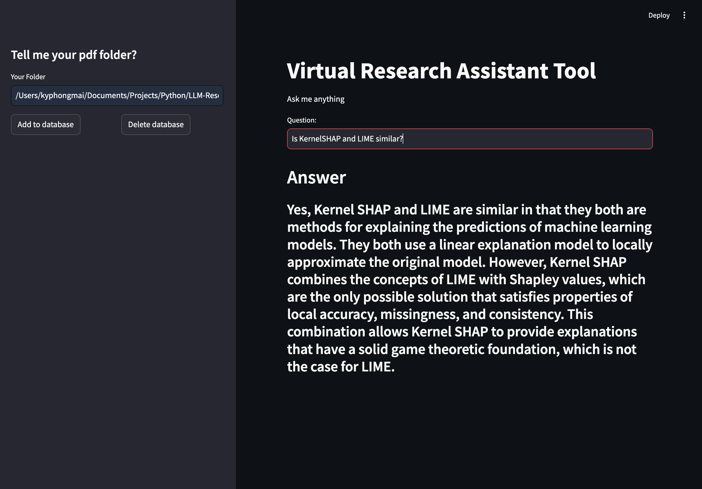
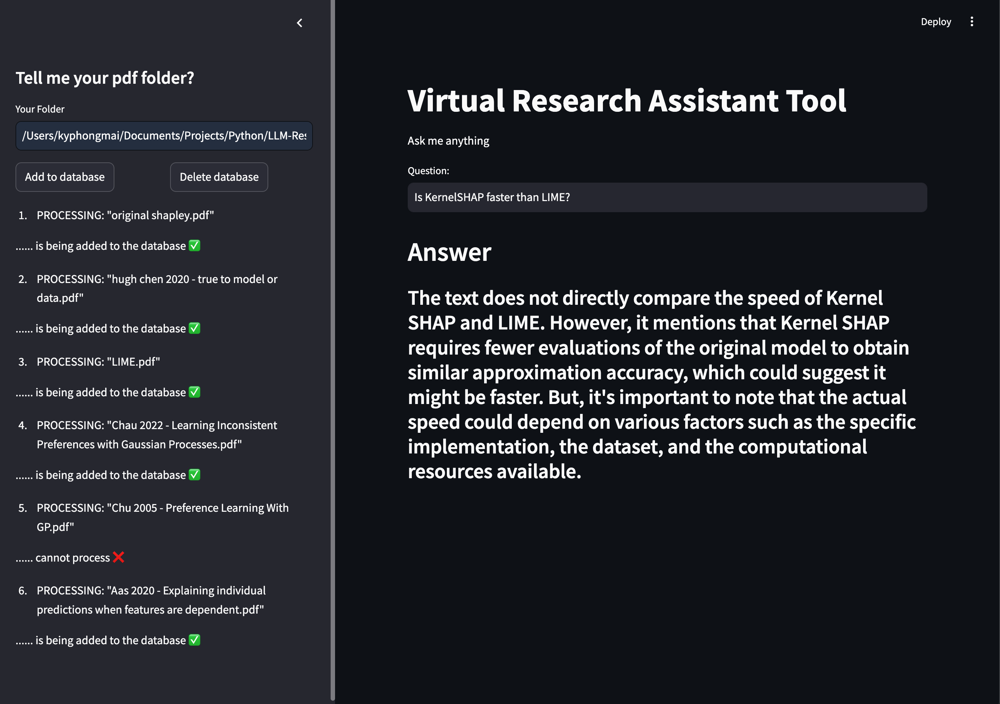

# LLM-Research-Tool
LLM research Q&amp;A tool implemented using Retrieval-Augmented Generation (RAG) and vector database Chroma

## Motivation
While working on my research project, I found it difficult to conduct a literature review on a brand new topic. To streamline this process, I implemented a proof of concept for an LLM tool that leverages knowledge from existing papers in PDF format, helping me work faster and more efficiently.

## Framework/Library
- LLM Framework (LangChain)
- Retrieval-Augmented Generation (RAG)
- Vector Database (Chroma)
- Proof of Concept (Streamlit)

## Components

### Indexing
The indexing component uses a vector database to store document embeddings, which represent the semantic content of the documents. By breaking down the documents into chunks and generating embeddings for these chunks, the system can efficiently query the database to retrieve only the relevant information, rather than including all the context in the prompt, which can be computationally expensive (the longer the prompts(more tokens) the more you have to pay)

### Retrieval and Generation
In the retrieval and generation component, queries are embedded and checked against the vector store to find matching documents. These matches are then used as context in the prompt for the LLM.

## Interface
- *Before Adding PDF to Database*: The text is not based on our database and uses information from external sources.
  


- *After Adding to Database*: The system extracts information from the papers in the database.
  
  
## Instructions

1. **Clone this Repo**:
    ```sh
   git clone https://github.com/kyphongmai/LLM-Research-Tool.git
   cd LLM-Research-Tool
    ```
2. **Create a New Virtual Environment**:
   ```sh
   python -m venv venv
   source venv/bin/activate   # On Windows, use `venv\Scripts\activate`
   ```
3. **Install Requirements**:
   ```sh
   pip install -r requirements.txt
   ```
4. **Replace Embedding Model and LLM Model**:
   
   Edit ```mainapp.py``` to replace the embedding model and LLM model accordingly. The current setup uses Sentence Transformer as the embedding model and ChatMistral AI as the LLM.

   Create a .env file in your project folder to store your model API keys:
   ```makefile
   HF_API_KEY="" 
   GOOGLE_API_KEY=""
   MISTRAL_API_KEY=""
   ```
5. **Run the application**:
   ```sh
   streamlit run mainapp.py
   ```
